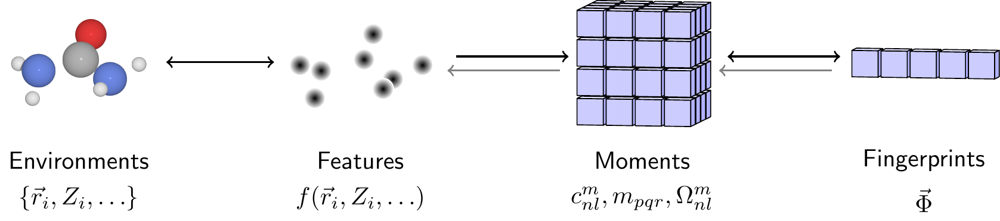

Moment Invariants Local Atomic Descriptor
=========================================

This repository contains code for creating rotation invariant descriptions of atomic environments.
The resulting fingerprint vectors can be decoded back into the original atomic system allowing one to build generative models of atomic environments in materials or entire molecules.

Code examples will be coming soon!

Contact martin [at] digitalbaker.net for more details.

MILAD is FOSS, under the GPLv3 license.
